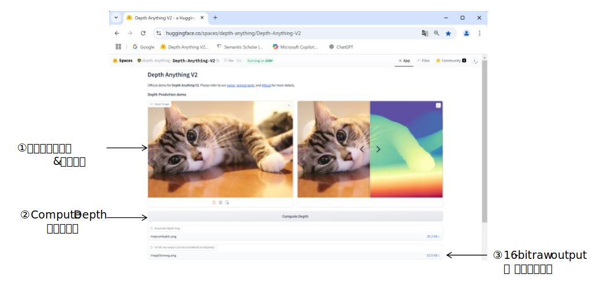
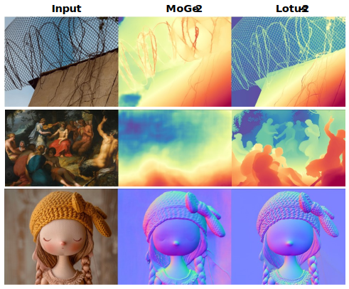
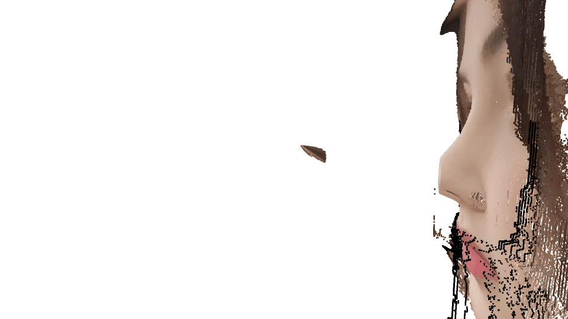

<html lang="ja">
    <head>
        <meta charset="utf-8" />
    </head>
    <body>
        <h1>
RgbDepth
</h1>
        <h2>なにものか？</h2>
        

            RGB画像とdepth画像を指定して、3Dオブジェクトを表示します。 
             
            入力画像 
             
            3Dオブジェクト表示 
            
        

        <h2>環境構築方法</h2>
        

            pip install opencv-python open3d
        

        <h2>使い方</h2>
        

            python  RgbDepth.py  (RGB画像ファイル)  (depth画像ファイル)  [(Zscale) (fx) (fy) (cx) (cy)] 
            ※ ピクセルとz値の比率が不明のため、Zscale引数で調整します。 
               その他のパラメータは下図参照 
            
            <table border="1">
                <tr><th>操作</th><th>機能</th></tr>
                <tr><td>左ボタン押下＋ドラッグ</td><td>3Dモデルの回転</td></tr>
                <tr><td>ホイールボタン押下＋ドラッグ</td><td>3Dモデルの移動</td></tr>
                <tr><td>ホイール回転</td><td>3Dモデルの拡大・縮小</td></tr>
                <tr><td>PrintScreenキー押下</td><td>スクリーンショット保存</td></tr>
                <tr><td>ウィンドウ閉じるボタン押下　</td><td>プログラム終了</td></tr>
            </table>
            <h3>使用例</h3>
                         
        

        <h2>RGB画像からdepth画像の作成例</h2>
        <h3>depth推定ソフトウェアで画像からdepth画像を作成する。</h3>
        

            Depth Anything V2 などを使って画像からdepth画像を作成する。 
            <a href="https://huggingface.co/spaces/depth-anything/Depth-Anything-V2">https://huggingface.co/spaces/depth-anything/Depth-Anything-V2</a> 
             
            
        

                <h2>Lotus-2が良さそうだったので試してみた</h2>
        

            Lotus-2という深度推定器はなかなか良さそう。
        

        
        

            Githubでコードが公開されているが、GPUメモリ40GBなどと記されており諦めてWEBデモを試してみた。 
            ・出力がグレースケールではなく、ヒートマップ表示だったので, 泥臭くdepth画像に変換してみた。 
            ・もっとスマートな方法があるとは思うが、やりかたを知らないので･･･ 
             
            [0] ヒートマップ画像を探して、値順の色相の配列を作成 (spectral.npy作成用。作成済なので実行不要) 
            python colormap2npy.py  
             
             
            [1] Lotus-2のWEBデモで画像から深度画像(ヒートマップ)を作成する。 
            <a href="https://huggingface.co/spaces/haodongli/Lotus-2_Depth">Lotus-2のDepth推定デモページ</a>　SSDマシンはダメみたい 
            ヒートマップの深度推定結果が得られる。(data/colormap_*.png 参照。鼻の頭の深度が飽和している･･･) 
             
            [2] spectral.npyを参照して、グレースケールの深度画像に変換する。 
            python heatmap2depth.py (ヒートマップ画像) 
             
            [3] 3D表示する。 
            python RgbDepth2.py (RGB画像) (グレースケールの深度画像) 
            ・ゴミが表示される･･･デバッグ中 
            ・鼻の頭がつぶれる･･･Lotus-2のヒートマップで潰れているので直せない 
            ・’@'キー, '[' キー押下で画角を変更可能。'[' キーを目いっぱい押した方が良いようだ。 
            ・1キー～6キーでモデルを回転できる。 
            ・出っ張り具合（Z scale)は第三引数で指定する。 
            ・縦に長くしたい場合は第四引数を大きくする。 
              
            RgbDepth2.py の以下のコメントを有効化(#を削除)すれば、ESCキー押下で点群をplyファイルに書き出しする。 
            その代わりプログラム終了に時間が掛かるようになる。 
            # base = os.path.basename(argv[1]) 
            # filename, _ = os.path.splitext(base) 
            # dst_path = '%s_o3d.ply' % filename 
            # o3d.io.write_point_cloud(dst_path, pcd) 
            # print('save %s' % dst_path) 
        

    </body>
</html>
