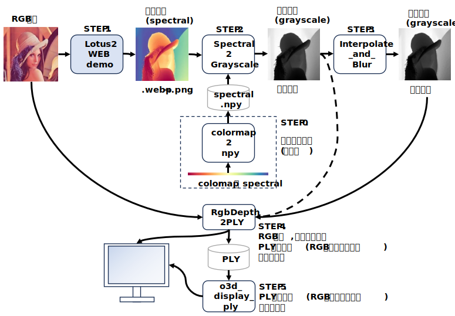
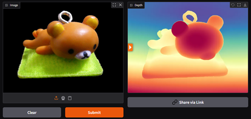
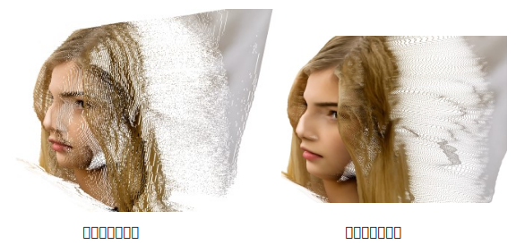

<html lang="ja">
    <head>
        <meta charset="utf-8" />
    </head>
    <body>
        <h1>
RgbDepth
</h1>
        <h2>なにものか？</h2>
        

            RGB画像とdepth画像を指定して、3Dオブジェクトを表示します。 
             
            入力画像 
             
            3Dオブジェクト表示 
            
        

        <h2>環境構築方法</h2>
        

            pip install opencv-python open3d
        

        <h2>使い方</h2>
        

            python  RgbDepth.py  (RGB画像ファイル)  (depth画像ファイル)  [(Zscale) (fx) (fy) (cx) (cy)] 
            ※ ピクセルとz値の比率が不明のため、Zscale引数で調整します。 
               その他のパラメータは下図参照 
            
            <table border="1">
                <tr><th>操作</th><th>機能</th></tr>
                <tr><td>左ボタン押下＋ドラッグ</td><td>3Dモデルの回転</td></tr>
                <tr><td>ホイールボタン押下＋ドラッグ</td><td>3Dモデルの移動</td></tr>
                <tr><td>ホイール回転</td><td>3Dモデルの拡大・縮小</td></tr>
                <tr><td>PrintScreenキー押下</td><td>スクリーンショット保存</td></tr>
                <tr><td>ウィンドウ閉じるボタン押下　</td><td>プログラム終了</td></tr>
            </table>
            <h3>使用例</h3>
                         
        

        <h2>RGB画像からdepth画像の作成例</h2>
        <h3>depth推定ソフトウェアで画像からdepth画像を作成する。</h3>
        

            Depth Anything V2 などを使って画像からdepth画像を作成する。 
            <a href="https://huggingface.co/spaces/depth-anything/Depth-Anything-V2">https://huggingface.co/spaces/depth-anything/Depth-Anything-V2</a> 
             
            
        

                <h2>Lotus-2が良さそうだったので試してみた</h2>
        

            Lotus-2という深度推定器はなかなか良さそう。
        

        
        

            Githubでコードが公開されているが、GPUメモリ40GBなどと記されており諦めてWEBデモを試してみた。 
            ・出力がグレースケールではなく、ヒートマップ表示だったので, 泥臭くdepth画像に変換してみた。 
            ・もっとスマートな方法があるとは思うが、やりかたを知らないので･･･ 
             
 

<h3>　STEP.0　カラーマップから色相の配列を作成する</h3>

　　python src2\colormap2npy.py  
　　この処理は一度実施するだけでよい(実施済) 
     

<h3>　STEP.1　Lotus-2 の WEB デモで画像から深度画像を作成する</h3>

　　<a href="https://huggingface.co/spaces/haodongli/Lotus-2_Depth">Lotus-2のDepth推定デモページ</a> 
　　カラーマップ(Spectral)の深度推定結果が得られる。 
     
　　・画面右上のダウンロードボタンを押して深度画像をダウンロードする。 
　　・MS Paintなどでダウンロードした深度画像(.webp)を .png に変換する。 

<h3>　STEP.2　カラーマップ(Spectral)の深度画像をグレースケールの深度画像に変換する</h3>
           

　　python src2\Spectral2Grayscale.py (Spectral Depth Image) 

    
<h3>　STEP.3　深度画像を補間する</h3>

　　カラーマップをグレースケールにした深度画像は諧調数が少なく深度にギャップができるので, 補間～ぼかしにより諧調を復元する。 
 
 　　python src2\interpolate_and_blur.py (グレースケール深度画像) [(ぼかすレベル)] 
 
　　※ 1ラインずつ2パス処理するので時間が掛かる･･･ 

 
　　※ 鼻のあたまが掛けているのは Lotus2の推定深度が飽和しているため 

<h3>　STEP.4　RGB画像, 深度画像からPLYファイルを作成する</h3>

　　python src2\RgbDepth2PLY.py　(RGB画像) (深度画像) 

<h3>　STEP.5　PLYファイルを表示する</h3>

　　python src2\o3d_display_ply.py　(PLYファイル) [(z値スケール)] 
 
　　・<strong>マウスドラッグ</strong>：　点群の回転 
　　・<strong>ホイールボタン＋マウスドラッグ</strong>：　点群の移動 
　　・<strong>`@`キー, '['キー</strong>：　表示画角変更 
 
　　・<strong>'-'キー,'＾'キー</strong>：　点群のサイズ変更 
 
　　・<strong>pキー</strong>：　スクリーンキャプチャー 
　　・<strong>1/2/3キー</strong>：　点群の回転,　<strong>＋Shiftキー</strong>：　逆回転,　<strong>＋Ctrlキー</strong>：　回転量10倍 
　　・<strong>4/5/6キー</strong>：　点群の平行移動,　<strong>＋Shiftキー</strong>：　逆方向に行移動　<strong>＋Ctrlキー</strong>：　移動量10倍 
　　・<strong>7キー</strong>：　回転ステップを下げる,　<strong>＋Shiftキー</strong>：　回転ステップを上げる 
　　・<strong>8キー</strong>：　平行移動ステップを下げる,　<strong>＋Shiftキー</strong>：　平行移動ステップを上げる 
　　・<strong>ESCキー</strong>:　終了　

</body>
</html>
